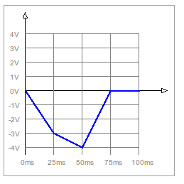

# Rust-RMS

Not a generic application, but just a simple CLI app for some tasks where average voltage and voltage rms are calculated.

## Usage

For the following signals: 



```
rms -p "t,0,-3,25 t,-3,-4,25 t,-4,0,25 s,0,25"
```

Triangles are treated as special trapezoids.

```
p -> periodic
t -> triangle, trapezoid
s -> square
```

